# DigAbyss — Architectural Documentation

## Executive Overview

**DigAbyss** is a modern, high-performance web platform designed to empower independent digital creators, artists, and teams. It serves a dual purpose:
1. **Digital Creative Marketplace**: A platform for buying, selling, trading, and negotiating digital assets (artwork, anime/manga prints, music albums, software templates, and physical prints).
2. **Creator & Enterprise Dashboard**: An analytics platform featuring real-time data visualization, order tracking, team project management, and account administration.

The system is built on a modern **React 19 + Vite + TypeScript** stack, utilizing **React Router v7** for declarative client-side routing, **Tailwind CSS v4** and **Shadcn UI** for styling, and **Firebase** (Auth, Firestore, Cloud Storage, Functions) alongside **Stripe** for backend services and payments.

---

## Technical Stack Architecture

| Layer | Technologies / Libraries |
| :--- | :--- |
| **Core Framework** | React 19, TypeScript ~6.0, Vite 8 |
| **Routing** | React Router v7 (`createBrowserRouter`, `RouterProvider`) |
| **Styling & Design System** | Tailwind CSS v4, Base UI (`@base-ui/react`), Class Variance Authority (`cva`), `clsx`, `tailwind-merge`, Lucide React |
| **Data Visualization & Tables**| Recharts (`recharts`), TanStack Table (`@tanstack/react-table`) |
| **Drag & Drop** | `@dnd-kit/core`, `@dnd-kit/sortable`, `@dnd-kit/modifiers` |
| **Notifications & Theme** | Sonner (`sonner`), Next Themes (`next-themes`) |
| **Backend & Services** | Firebase v11 (Authentication, Cloud Firestore, Cloud Storage, Functions), Stripe SDK |
| **Form & Validation** | Zod (`zod`), Native Controlled Form State |

---

## Directory Structure

```
digabyss/
├── Firebase/                     # Modular Firebase & Backend Integrations
│   ├── CloudFirestore/           # Firestore CRUD operation abstractions
│   │   ├── GetData.tsx           # Collection, document & compound query fetchers
│   │   ├── SetData.tsx           # Document creation and activity logger
│   │   ├── UpdateData.tsx        # Document & array updating utilities
│   │   └── DeleteData.tsx        # Document removal routines
│   ├── FirebaseAuth/            # Firebase Authentication actions
│   │   ├── UserLogin.tsx         # Email/password authentication handler
│   │   ├── UserSignUp.tsx        # User registration handler
│   │   ├── UserLogOut.tsx        # Logout hook & sign-out routine
│   │   ├── UserForgotPassword.tsx# Password reset request handler
│   │   └── DeleteUser.tsx        # Account deletion routine
│   ├── CloudStorage/             # Firebase Storage upload utilities
│   │   ├── UploadFile.tsx        # File upload and deletion helpers
│   │   └── UploadImages.tsx      # Image batch upload helpers
│   ├── firebase.tsx              # Firebase app initialization & config
│   ├── stripe.ts                 # Stripe payment checkout & customer service integration
│   └── index.tsx                 # Centralized Firebase exports barrel file
├── public/                       # Static public assets
├── src/
│   ├── App.tsx                   # Core App wrapper using RouterProvider
│   ├── router.tsx                # React Router v7 centralized router configuration
│   ├── main.tsx                  # React DOM root entry point with global providers
│   ├── index.css                 # Global Tailwind v4 CSS configuration & design tokens
│   ├── app/                      # Protected Dashboard App Views
│   │   └── dashboard/
│   │       ├── DashboardPage.tsx # Main dashboard page component
│   │       ├── AnalyticsPage.tsx # Deep analytics page with interactive charts
│   │       ├── SettingsPage.tsx  # User & organization settings interface
│   │       └── data.json         # Mock dataset for tables and dashboard charts
│   ├── Pages/                    # Top-Level Page Views
│   │   ├── Authentication/       # Auth Pages (LoginPage.tsx, SignupPage.tsx)
│   │   └── Website/              # Public Marketing & Marketplace Pages (TypeScript)
│   │       ├── HomePage/         # Primary marketplace landing page (HomePage.tsx)
│   │       ├── AboutPage/        # Company vision & about page (AboutPage.tsx)
│   │       ├── CareerPage/       # Open roles & company culture page (CareerPage.tsx)
│   │       ├── ContactPage/      # Inquiry form & support page (ContactPage.tsx)
│   │       ├── LoginSignup/      # Combined login/signup page component (LoginSignup.tsx)
│   │       ├── MyAccountPage/    # User profile, published assets & orders (MyAccountPage.tsx)
│   │       ├── OrderInformationPage/# Order tracking & fulfillment process (OrderInformationPage.tsx)
│   │       ├── PrivacyPolicyPage/# Platform privacy guidelines (PrivacyPolicyPage.tsx)
│   │       ├── ShopPage/         # Product search, filter & marketplace page (ShopPage.tsx)
│   │       └── TermsConditionsPage/# Legal terms & conditions (TermsConditionsPage.tsx)
│   ├── components/               # Application UI Components
│   │   ├── app-sidebar.tsx       # Collapsible application sidebar
│   │   ├── site-header.tsx       # Sticky top navigation bar for dashboard
│   │   ├── chart-area-interactive.tsx # Interactive area charts with Recharts
│   │   ├── data-table.tsx        # TanStack data tables with pagination & sorting
│   │   ├── login-form.tsx        # Login form component
│   │   ├── signup-form.tsx       # Signup form component
│   │   ├── section-cards.tsx     # Stat cards & metric widgets
│   │   ├── nav-main.tsx          # Main navigation links for sidebar
│   │   ├── nav-projects.tsx      # Project shortcuts list
│   │   ├── nav-documents.tsx     # Document shortcuts list
│   │   ├── nav-secondary.tsx     # Secondary sidebar options
│   │   ├── nav-user.tsx          # User profile badge & dropdown menu
│   │   ├── theme-provider.tsx    # Theme context provider
│   │   ├── theme-toggle.tsx      # Dark/light mode switcher
│   │   └── ui/                   # Reusable Shadcn UI Primitives (37 components)
│   ├── hooks/                    # Custom React Hooks
│   │   └── use-mobile.ts         # Responsive breakpoint detection hook
│   └── layouts/                  # App Layout Shells
│       ├── WebsiteLayout.tsx     # Public marketing header & footer layout
│       ├── AuthLayout.tsx        # Split screen authentication layout
│       └── DashboardLayout.tsx   # Sidebar + site header dashboard wrapper
└── vite.config.ts                # Vite build and path alias configuration (`@/`)
```

---

## Application Flow & Route Architecture

Navigation and routing are handled via a centralized router definition in `src/router.tsx` using `createBrowserRouter` from React Router v7.

```mermaid
flowchart TD
    App[App.tsx / RouterProvider] --> Router[src/router.tsx]

    Router --> PublicGroup[Public Route Shell - WebsiteLayout]
    Router --> AuthGroup[Auth Route Shell - AuthLayout]
    Router --> DashGroup[Dashboard Route Shell - DashboardLayout]

    PublicGroup --> Home["/ (HomePage.tsx)"]
    PublicGroup --> Shop["/shop (ShopPage.tsx)"]
    PublicGroup --> About["/about (AboutPage.tsx)"]
    PublicGroup --> Contact["/contact (ContactPage.tsx)"]
    PublicGroup --> Careers["/careers (CareerPage.tsx)"]
    PublicGroup --> Account["/my-account (MyAccountPage.tsx)"]
    PublicGroup --> Orders["/order-info (OrderInformationPage.tsx)"]
    PublicGroup --> Privacy["/privacy-policy (PrivacyPolicyPage.tsx)"]
    PublicGroup --> Terms["/terms (TermsConditionsPage.tsx)"]

    AuthGroup --> Login["/login (LoginPage.tsx)"]
    AuthGroup --> Signup["/signup (SignupPage.tsx)"]
    AuthGroup --> LoginSignup["/login-signup (LoginSignup.tsx)"]

    DashGroup --> DashMain["/dashboard (DashboardPage.tsx)"]
    DashGroup --> Analytics["/dashboard/analytics (AnalyticsPage.tsx)"]
    DashGroup --> Settings["/dashboard/settings (SettingsPage.tsx)"]

    Router --> CatchAll["* -> Redirect to /"]
```



### Layout Shell Breakdown

1. **`WebsiteLayout` (`src/layouts/WebsiteLayout.tsx`)**:
   - Wraps all marketing and e-commerce pages.
   - Contains a sticky navigation bar with active path highlighting, brand logo, search links, and quick action buttons.
   - Includes a responsive multi-column footer with quick links to Marketplace, Account, Company, and social media handles.
   - Renders child routes through `<Outlet />`.

2. **`AuthLayout` (`src/layouts/AuthLayout.tsx`)**:
   - Wraps `/login`, `/signup`, and `/login-signup`.
   - Features a split-screen design: login/signup form on one side, and a dynamic promotional hero banner on the other.
   - Includes seamless back-navigation to the main site.

3. **`DashboardLayout` (`src/layouts/DashboardLayout.tsx`)**:
   - Wraps all `/dashboard` routes.
   - Leverages `SidebarProvider` to render a responsive, collapsible sidebar (`AppSidebar`).
   - Displays breadcrumb navigation, search bar, notifications, and dark/light theme toggles in `SiteHeader`.

---

## Component Ecosystem & UI Architecture

### 1. Shadcn UI Component Library (`src/components/ui/`)
The application features a comprehensive atomic design system powered by Radix / Base UI primitives:

- **Navigation & Shell**: `sidebar.tsx`, `breadcrumb.tsx`, `sheet.tsx`, `pagination.tsx`, `tabs.tsx`
- **Data Display**: `card.tsx`, `table.tsx`, `avatar.tsx`, `badge.tsx`, `separator.tsx`, `skeleton.tsx`, `spinner.tsx`, `bubble.tsx`, `empty.tsx`
- **Form Controls**: `button.tsx`, `input.tsx`, `textarea.tsx`, `checkbox.tsx`, `radio-group.tsx`, `select.tsx`, `combobox.tsx`, `toggle.tsx`, `toggle-group.tsx`, `field.tsx`, `input-group.tsx`
- **Overlay & Modals**: `dialog.tsx`, `alert-dialog.tsx`, `drawer.tsx`, `dropdown-menu.tsx`, `hover-card.tsx`, `tooltip.tsx`
- **Feedback**: `alert.tsx`, `sonner.tsx`, `attachment.tsx`

### 2. Analytical & Visual Components
- **`ChartAreaInteractive` (`src/components/chart-area-interactive.tsx`)**: Powered by **Recharts**, provides responsive data visualization for visitor analytics, revenue trends, and platform engagement with time-range filtering (7d, 30d, 90d).
- **`DataTable` (`src/components/data-table.tsx`)**: Powered by **TanStack Table**, supports column sorting, global search filtering, pagination, and row selection for complex tabular data.
- **`SectionCards` (`src/components/section-cards.tsx`)**: Metric key performance indicators (KPIs) displaying stats with percentage change indicators and icon highlights.

---

## Backend & Firebase Architecture

Backend operations are modularized inside the `Firebase/` directory and exported cleanly through `Firebase/index.tsx`.

```
Firebase Infrastructure
├── Authentication (FirebaseAuth/)
│   ├── emailPasswordLogin()
│   ├── emailPasswordSignUp()
│   ├── useLogout()
│   └── UserForgotPassword()
├── Firestore Database (CloudFirestore/)
│   ├── getDocumentData() / getCollectionData() / compoundQuery()
│   ├── addDocument() / createDocument() / logActivity()
│   ├── updateDocument() / updateArray()
│   └── deleteDocument()
├── Cloud Storage (CloudStorage/)
│   ├── UploadImage() / deleteImage()
│   └── uploadFile() / deleteFile()
└── External Payments (stripe.ts)
    ├── createCheckoutSession()
    └── getCustomerPortalUrl()
```

### Database Abstraction Layer (`Firebase/CloudFirestore/`)
The app abstracts raw Firestore calls into typed utility functions:
- **`GetData.tsx`**: Provides query builders like `compoundQuery`, document count fetchers (`numOfDocuments`), and document/collection retrieval methods (`getDocumentData`, `getCollectionData`).
- **`SetData.tsx`**: Handles document creation with server timestamps and logs user activity trails (`logActivity`).
- **`UpdateData.tsx`**: Facilitates partial document updates and array union/removal updates (`updateArray`).
- **`DeleteData.tsx`**: Manages document deletion logic safely.

### Payment Gateway Layer (`Firebase/stripe.ts`)
Handles subscription and digital purchase checkouts using Stripe sessions, supporting customer portal management for active subscribers.

---

## Data Flow & State Management

1. **Routing & Location State**: React Router v7 (`useLocation`, `useNavigate`, `Link`, `Outlet`) manages application history, active tab highlighting, and deep linking across pages.
2. **UI State & Theme Context**:
   - `ThemeProvider` (`src/components/theme-provider.tsx`) handles light, dark, and system theme switching via `next-themes`.
   - Local state (`useState`) handles interactive UI states such as active filters, quick-view modals, search queries, pagination, and slideout panels.
3. **Async Data & Real-time Feeds**:
   - `data.json` provides mock fallbacks for dashboard charts and analytics tables.
   - Firestore listeners and fetchers provide real-time updates for live user content.

---

## Verification & Build Setup

- **Type Safety**: Fully typed with strict TypeScript rules (`npx tsc --noEmit`).
- **Development Server**: Run `npm run dev` to start Vite dev server.
- **Production Build**: Run `npm run build` (`tsc -b && vite build`) to create an optimized production bundle in `dist/`.
- **Code Formatting & Linting**: ESLint flat config (`eslint.config.js`) and Prettier (`.prettierrc`) maintain strict code cleanliness.
